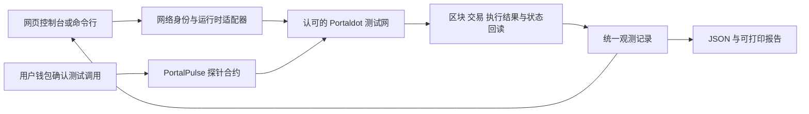

# PortalPulse 产品设计

设计日期：2026-10-09。赛道：Node Operations & Tooling。本文描述未来实现，当前仓库仍为准备文档；交付状态见[时间线](roadmap.md)，验证条件见[验收标准](acceptance.md)。

## 用户问题与首版流程

节点运营者需要判断端点是否可达、区块是否推进及最终确认是否停滞；DApp 开发者需要知道交易是否真的执行成功、状态是否正确保存。PortalPulse 将把这些阶段分开显示，并提供可复核证据。

1. 选择已经确认的 Portaldot 测试网配置，检查网络身份。
2. 查看 RPC 延迟、最新区块、已最终确认区块和最近错误。
3. 部署或选择探针合约，在钱包中确认一次更新测试序号的调用。
4. 观察提交、纳入区块、执行成功、最终确认、状态回读五个阶段。
5. 导出报告，由其他人按同一网络、合约、交易与区块重新核对。
6. 模拟端点断开或导入不匹配记录，显示异常或未验证。

探针只保存发起者对应的测试序号；每个发起者仅更新自己的序号。不转移、托管或质押资产。首版不接账户付费、短信或邮件告警、多链资产桥或用户私钥托管；告警先在控制台内显示。后续产品方向可考虑托管监测、历史留存和团队运行报告。

## 六个模块与交付边界

| 模块 | 计划行为与判定依据 |
|---|---|
| 网络身份与能力 | 显示配置来源、网络名称、创世哈希、运行时版本；区分主网、活动测试网和第三方开发节点。身份不符禁止写入，未知能力标未验证 |
| 节点监控 | 保存连接结果、请求耗时、区块高度变化与最终确认推进。无响应、数据陈旧及网络无推进分别显示，不能以空数据或旧缓存显示正常 |
| 执行回读 | 使用区块和当前交易定位执行结果，再核对探针状态。纳入但执行失败保持异常；最终确认和状态匹配后才完成全流程验证 |
| 探针合约 | 在主办方认可测试网上新部署，提供序号更新、读取和事件或等效回执，并至少完成一次真实更新及读回 |
| 报告与复核 | 导出时间、来源、身份、合约、交易、区块及状态结果；重新导入检查字段与摘要，不匹配不能通过 |
| 命令行工具 | 本机查询、持续监测和生成同结构报告；新环境可复现，超时、失败、未验证有明确退出结果 |

## 架构与接入能力

网页计划使用 TypeScript、React、Vite；命令行计划使用 Node.js 22+。网络适配器读取元数据并归一化记录，界面和报告仅消费统一结果。实施时核验官方依赖来源、锁定版本并公开说明。

Substrate / WASM 为优先核验路径。EVM 仅在官方提供可用接口、网络身份核对及真实测试通过后接入。活动宣传的 VM 兼容性不能证明某个端点支持 EVM；分别调用两类合约也不能作为跨 VM 交互已经实现的证据。

公开 RPC 供网页读数据，签名调用由用户钱包确认。本机命令行可持续监测。浏览器若无法连接端点，应显示连接失败，并允许导入真实命令行记录；导入属于离线记录，始终显示采集时间、窗口及来源，不显示实时在线状态。

部署和写入前，必须确认主办方认可的 RPC、网络身份、测试币领取路径、浏览器或等效查询方式，以及合约开发版本。官方主网只读，写入流程明确拒绝已知主网创世哈希；运行时或身份不能确认时也不得启用写入。[网络预检](network-preflight.md)记录现有主网信息及证据局限。

## 统一记录与四类状态

| 记录类别 | 必需数据 |
|---|---|
| 每次观测 | 网络配置标识、配置来源、创世哈希、运行时版本、观测时间、端点别名、请求方法、耗时、结果状态 |
| 执行记录 | 虚拟机类型、合约地址、预期测试序号、交易哈希、区块哈希、交易索引、执行事件、最终确认依据、状态回读值、回读区块 |
| 导出记录 | 数据结构版本、采集起止时间、观察窗口、上述观测与执行记录、SHA-256 内容摘要 |

| 状态 | 含义 |
|---|---|
| 正常 | 对应检查已有充分且匹配的记录；完整执行验证还要求最终确认和状态读回匹配 |
| 异常 | 明确的超时、连接失败、执行失败、状态不符或陈旧告警 |
| 未验证 | 元数据缺失、无法解码、无法找到对应记录、能力未知或推进基线不足 |
| 采集中 | 当前检查或交易阶段尚在进行；不得展示完整验证已通过 |

超时、缺失元数据、无法解码及查不到的记录均不能转成成功。Substrate 交易复核使用区块哈希与交易哈希，结合交易索引和执行事件定位，不能假设存在通用交易索引查询接口。

## 采集与可信度

默认每 **10 秒**采集一次，每个请求 **8 秒**超时。界面始终显示观察窗口、采集起止时间与最后更新时间。观察至少**三个相邻区块变化**后建立区块间隔基线；之前不宣称区块推进正常。基线建立后，超过 **max(180 秒, 3 倍区块间隔中位数)** 没有观察到推进时报警。端点连接错误可自动重连；合约写入不能自动重签或重复发送。

浏览器本地最多保存 **2,000 条观测**，满额后删除最早记录并提示剩余窗口范围。导出使用版本化结构与 SHA-256 检测内容改动；保存量和观测时长不能等同于全天可用性。

摘要用于发现报告被改动，不能证明 RPC 提供者所报数据真实。单一 RPC 的信任局限始终保留；首版提供可复核记录，不宣称提供独立轻客户端共识证明。

产品适用的活动与赛道依据：[本届官方详情](https://dorahacks.io/hackathon/portaldot-hacker-house-2026/detail)、[官方赛道](https://dorahacks.io/hackathon/portaldot-hacker-house-2026/tracks)。
